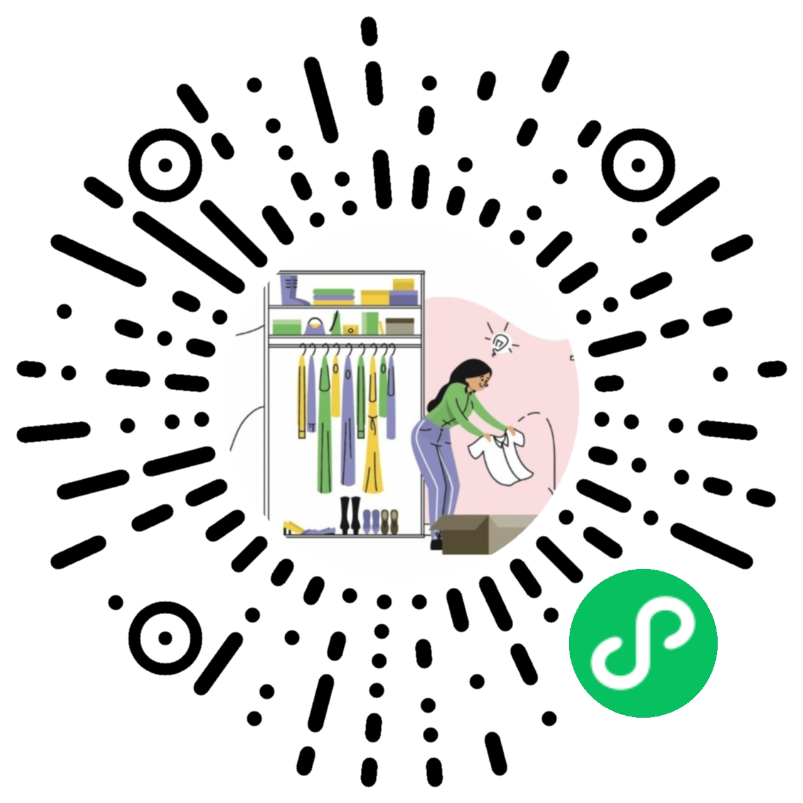

Rails app generated with [lewagon/rails-templates](https://github.com/lewagon/rails-templates), created by the [Le Wagon coding bootcamp](https://www.lewagon.com) team.

## de-closet-backend

**DeCloset** is a fullstack project.

- **Frontend**: WeChat Mini Program (微信小程序)
- **Backend**: Ruby on Rails

This repository includes the backend part. To see the frontend code, please click this [link to the frontend repository](https://github.com/ArrowShaw/de-closet-mp).

Scan the QR Code below to use this WeChat Mini Program:

